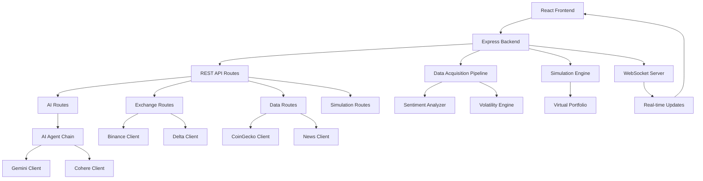

# NuralML SpotAI - AI-Powered Crypto Scalping Platform

[](https://opensource.org/licenses/MIT)
[](https://nodejs.org/)
[](https://reactjs.org/)

A comprehensive AI-powered cryptocurrency scalping platform that combines real-time market data, advanced sentiment analysis, and multi-agent AI decision-making for high-frequency trading strategies.

## Table of Contents

- [Project Overview](#project-overview)
- [Key Features](#key-features)
- [Architecture](#architecture)
- [Prerequisites](#prerequisites)
- [System Requirements](#system-requirements)
- [Installation](#installation)
- [API Key Configuration](#api-key-configuration)
- [Environment Setup](#environment-setup)
- [Usage](#usage)
- [API Documentation](#api-documentation)
- [Ethical AI Use](#ethical-ai-use)
- [Troubleshooting](#troubleshooting)
- [Contributing](#contributing)
- [License](#license)

## Project Overview

NuralML SpotAI is a full-stack web application designed for AI-powered cryptocurrency scalping. The platform integrates multiple data sources, AI models, and trading exchanges to provide real-time trading signals and automated execution capabilities. The system features a sophisticated AI agent chain that analyzes market conditions, sentiment, and technical indicators to generate scalping recommendations with 5-15 minute holding periods.

### Core Components

- **Frontend**: React-based web application with real-time charts and trading interface
- **Backend**: Node.js/Express server with WebSocket support for real-time data
- **AI Engine**: Multi-agent system using Google Gemini and Cohere for market analysis and strategy generation
- **Data Pipeline**: Real-time data acquisition from multiple cryptocurrency exchanges
- **Simulation Engine**: Risk-free trading simulation with performance analytics
- **Sentiment Analysis**: FinBERT-powered news sentiment analysis for market bias detection

## Key Features

### 🤖 AI-Powered Trading
- **Multi-Agent AI Chain**: Sequential processing through market analysis, strategy reasoning, and trade execution agents
- **Real-time Market Analysis**: Continuous evaluation of price action, order book depth, and volatility
- **Sentiment Integration**: News-based sentiment analysis using FinBERT model
- **Options Strategy Generation**: Delta, gamma, and vega-aware scalping strategies

### 📊 Real-Time Data
- **Multi-Exchange Support**: Binance and Delta Exchange integration
- **WebSocket Streaming**: Real-time ticker, order book, and trade data
- **Historical Data**: Configurable timeframe data for backtesting
- **News Aggregation**: Real-time cryptocurrency news from NewsAPI

### 🎯 Trading Features
- **Scalping Focus**: Optimized for 5-30 minute holding periods
- **Risk Management**: Configurable position sizing and drawdown limits
- **Simulation Mode**: Paper trading with realistic fee simulation
- **Performance Analytics**: Win rate, Sharpe ratio, and drawdown tracking

### 🔧 Technical Features
- **Modular Architecture**: Clean separation of concerns with independent modules
- **Rate Limiting**: API protection and fair usage policies
- **Error Handling**: Graceful degradation and comprehensive error recovery
- **Logging**: Winston-based logging with daily rotation
- **Authentication**: GitHub OAuth integration for user management

## Architecture



### Data Flow

1. **Data Acquisition**: Continuous market data collection via WebSocket streams
2. **AI Processing**: Multi-agent chain processes market context for trading signals
3. **Risk Assessment**: Position sizing and risk management validation
4. **Execution**: Simulated or live trade execution with real-time monitoring
5. **Performance Tracking**: Comprehensive analytics and reporting

## Prerequisites

- **Node.js** 18.0 or higher
- **npm** 8.0 or higher
- **Git** for version control
- **Web browser** with WebSocket support (Chrome 90+, Firefox 88+, Safari 14+)

## System Requirements

### Minimum Requirements
- **CPU**: Dual-core 2.5 GHz
- **RAM**: 4 GB
- **Storage**: 500 MB free space
- **Network**: Stable internet connection (recommended: 10 Mbps)

### Recommended Requirements
- **CPU**: Quad-core 3.0 GHz or higher
- **RAM**: 8 GB or more
- **Storage**: 1 GB free space
- **Network**: High-speed internet (25 Mbps+) for real-time data

### Supported Operating Systems
- **Windows**: 10 or 11 (64-bit)
- **macOS**: 10.15 or later
- **Linux**: Ubuntu 18.04+, CentOS 7+, or equivalent

## Installation

### Frontend Setup

1. **Clone the repository**
   ```bash
   git clone https://github.com/your-username/nuralml-spotai.git
   cd nuralml-spotai
   ```

2. **Install frontend dependencies**
   ```bash
   cd client
   npm install
   ```

3. **Install frontend build tools**
   ```bash
   # Tailwind CSS and PostCSS are included in devDependencies
   npm install -D tailwindcss postcss autoprefixer
   ```

### Backend Setup

1. **Install backend dependencies**
   ```bash
   cd ../server
   npm install
   ```

2. **Install development dependencies** (optional)
   ```bash
   npm install -D nodemon jest supertest nock
   ```

### Environment Configuration

1. **Copy environment template**
   ```bash
   cp .env.example .env
   ```

2. **Configure API keys** (see [API Key Configuration](#api-key-configuration))

## API Key Configuration

The application requires several API keys for full functionality. All keys are free-tier eligible:

### Required API Keys

#### 1. Google AI (Gemini 1.5 Pro)
- **Purpose**: Primary AI model for market analysis and strategy generation
- **Free Tier**: 60 requests/minute, 1,000 requests/day
- **Setup**:
  1. Visit [Google AI Studio](https://makersuite.google.com/app/apikey)
  2. Create a new API key
  3. Add to `.env`: `GOOGLE_AI_API_KEY=your-gemini-api-key`

#### 2. Cohere AI
- **Purpose**: Secondary AI model for trade execution logic
- **Free Tier**: 1,000 API calls/month
- **Setup**:
  1. Visit [Cohere Dashboard](https://dashboard.cohere.com/api-keys)
  2. Generate API key
  3. Add to `.env`: `COHERE_API_KEY=your-cohere-api-key`

#### 3. NewsAPI
- **Purpose**: Real-time cryptocurrency news for sentiment analysis
- **Free Tier**: 100 requests/day
- **Setup**:
  1. Visit [NewsAPI](https://newsapi.org/register)
  2. Get API key
  3. Add to `.env`: `NEWS_API_KEY=your-news-api-key`

### Exchange API Keys (Optional for Live Trading)

#### 4. Binance API
- **Purpose**: Live trading execution and market data
- **Free Tier**: Spot trading API (no trading fees for API)
- **Setup**:
  1. Visit [Binance API Management](https://www.binance.com/en/my/settings/api-management)
  2. Create API key with spot trading permissions
  3. Add to `.env`:
     ```
     BINANCE_API_KEY=your-binance-api-key
     BINANCE_API_SECRET=your-binance-api-secret
     ```

#### 5. Delta Exchange API
- **Purpose**: Options trading and advanced order types
- **Free Tier**: Available with account registration
- **Setup**:
  1. Visit [Delta Exchange API](https://docs.delta.exchange/#api-keys)
  2. Generate API credentials
  3. Add to `.env`:
     ```
     DELTA_API_KEY=your-delta-api-key
     DELTA_API_SECRET=your-delta-api-secret
     ```

### Authentication (Optional)

#### 6. GitHub OAuth
- **Purpose**: User authentication and session management
- **Free Tier**: Unlimited for OAuth apps
- **Setup**:
  1. Visit [GitHub Developer Settings](https://github.com/settings/developers)
  2. Create OAuth App
  3. Set callback URL to your frontend URL
  4. Add to `.env`:
     ```
     GITHUB_CLIENT_ID=your-github-client-id
     GITHUB_CLIENT_SECRET=your-github-client-secret
     ```

## Environment Setup

Create a `.env` file in the `server/` directory with the following variables:

```env
# Server Configuration
NODE_ENV=development
PORT=3001
FRONTEND_URL=http://localhost:3000

# Database
DATABASE_URL=database.db

# JWT and Session Secrets
JWT_SECRET=your-super-secure-jwt-secret-here
SESSION_SECRET=your-super-secure-session-secret-here

# AI API Keys
GOOGLE_AI_API_KEY=your-gemini-api-key
COHERE_API_KEY=your-cohere-api-key

# Data APIs
NEWS_API_KEY=your-news-api-key

# Exchange APIs (Optional)
BINANCE_API_KEY=your-binance-api-key
BINANCE_API_SECRET=your-binance-api-secret
DELTA_API_KEY=your-delta-api-key
DELTA_API_SECRET=your-delta-api-secret

# Authentication (Optional)
GITHUB_CLIENT_ID=your-github-client-id
GITHUB_CLIENT_SECRET=your-github-client-secret

# Data Acquisition Pipeline
DAPP_INTERVAL=5000
```

### Environment Variable Explanations

- `NODE_ENV`: Environment mode (`development`, `production`)
- `PORT`: Backend server port (default: 3001)
- `FRONTEND_URL`: Frontend application URL for CORS
- `DATABASE_URL`: SQLite database file path
- `JWT_SECRET`: Secret for JWT token signing (use strong random string)
- `SESSION_SECRET`: Secret for session management (use strong random string)
- `DAPP_INTERVAL`: Data acquisition interval in milliseconds (default: 5000ms)

## Usage

### Development Mode

1. **Start the backend server**
   ```bash
   cd server
   npm run dev  # Uses nodemon for auto-restart
   ```

2. **Start the frontend application**
   ```bash
   cd client
   npm start
   ```

3. **Access the application**
   - Frontend: http://localhost:3000
   - Backend API: http://localhost:3001
   - Health Check: http://localhost:3001/health

### Production Mode

1. **Build the frontend**
   ```bash
   cd client
   npm run build
   ```

2. **Start the backend**
   ```bash
   cd server
   npm start
   ```

### Trading Modes

#### Simulation Mode (Recommended for Testing)
- Risk-free paper trading with virtual portfolio
- Realistic fee simulation (0.1% per trade)
- Performance tracking and analytics
- No real money at risk

#### Live Trading Mode (Advanced Users)
- Requires exchange API keys
- Real money trading with actual positions
- Enhanced risk management features
- Real-time position monitoring

### Key Workflows

#### 1. Market Analysis
- View real-time price charts and indicators
- Monitor order book depth and market sentiment
- Analyze volatility and support/resistance levels

#### 2. AI Signal Generation
- Input market context and account balance
- AI agent chain processes data for 3 strategy recommendations
- Review confidence scores and risk metrics

#### 3. Trade Execution
- Execute trades in simulation or live mode
- Monitor positions and P&L in real-time
- Automatic risk management and position sizing

#### 4. Performance Review
- Analyze trading performance metrics
- Review win rate, Sharpe ratio, and drawdown
- Export trade history and analytics

## API Documentation

### Base URL
```
http://localhost:3001/api
```

### Authentication
All trading endpoints require user authentication via GitHub OAuth.

### Key Endpoints

#### AI Endpoints

**POST /api/ai/scalping-recommendation**
Generate AI-powered scalping recommendations.

**Request Body:**
```json
{
  "symbol": "BTCUSDT",
  "marketContext": {
    "price": 45000,
    "volume": 1000000,
    "volatility": 0.02,
    "sentiment": 0.3
  },
  "accountBalance": 10000
}
```

**Response:**
```json
{
  "success": true,
  "symbol": "BTCUSDT",
  "marketStateReport": {...},
  "strategyRecommendations": [...],
  "executableTrade": {...},
  "timestamp": "2024-01-01T12:00:00.000Z"
}
```

**GET /api/ai/status**
Check AI services configuration and health.

#### Exchange Endpoints

**GET /api/exchange/binance/ticker/:symbol**
Get real-time ticker data from Binance.

**GET /api/exchange/binance/historical/:symbol**
Get historical candlestick data.

**Parameters:**
- `interval`: Timeframe (1m, 5m, 1h, 1d)
- `limit`: Number of candles (max 1000)

#### Data Endpoints

**GET /api/data/news**
Fetch cryptocurrency news articles.

**GET /api/data/historical/:coinId**
Get historical price data from CoinGecko.

#### Simulation Endpoints

**POST /api/simulation/start**
Initialize simulation mode.

**POST /api/simulation/execute-trade**
Execute a simulated trade.

**GET /api/simulation/portfolio**
Get current portfolio status.

### Rate Limits
- AI endpoints: 10 requests/minute per user
- Exchange endpoints: 100 requests/minute per user
- Data endpoints: 50 requests/minute per user

### Error Handling
All endpoints return standardized error responses:
```json
{
  "error": "Error description",
  "code": "ERROR_CODE",
  "timestamp": "2024-01-01T12:00:00.000Z"
}
```

## Ethical AI Use

### Principles

#### 1. Market Integrity
- **No Market Manipulation**: AI signals are generated solely from public market data and news
- **Transparency**: All AI decision-making processes are logged and auditable
- **Fair Access**: Platform features are available to all users without discrimination

#### 2. Risk Management
- **Position Limits**: Maximum 5% of account balance per trade
- **Drawdown Protection**: Automatic trading suspension at 10% drawdown
- **Risk-Reward Validation**: Minimum 1:1.5 risk-reward ratio required

#### 3. Bias Mitigation
- **Data Diversity**: Multiple data sources prevent single-point failures
- **Sentiment Balancing**: News analysis considers multiple perspectives
- **Model Validation**: Regular performance monitoring and model updates

#### 4. Responsible AI
- **Human Oversight**: All live trading requires explicit user confirmation
- **Simulation First**: New strategies must be validated in simulation mode
- **Continuous Learning**: AI models are updated with performance feedback

### Compliance
- **Regulatory Awareness**: Users are responsible for compliance with local regulations
- **Tax Reporting**: Maintain detailed trade records for tax purposes
- **KYC Requirements**: Exchange API keys require proper account verification

## Troubleshooting

### Common Issues

#### 1. API Key Errors
**Error**: "AI services not configured"
**Solution**:
- Verify API keys in `.env` file
- Check API key validity and quotas
- Ensure correct environment variable names

#### 2. WebSocket Connection Issues
**Error**: "WebSocket connection failed"
**Solution**:
- Check firewall settings for WebSocket ports
- Verify backend server is running on correct port
- Check browser compatibility (WebSockets required)

#### 3. Database Connection Errors
**Error**: "Database connection failed"
**Solution**:
- Ensure SQLite database file exists
- Check file permissions in server directory
- Verify DATABASE_URL in environment variables

#### 4. Memory Issues
**Error**: "Out of memory" or slow performance
**Solution**:
- Increase Node.js memory limit: `node --max-old-space-size=4096 server.js`
- Close unnecessary browser tabs
- Monitor system resources during data-intensive operations

#### 5. Rate Limiting
**Error**: "Rate limit exceeded"
**Solution**:
- Wait for rate limit reset (typically 1 minute)
- Reduce request frequency
- Upgrade to paid API tiers if needed

### Debug Mode

Enable detailed logging:
```bash
DEBUG=* npm run dev
```

### Health Checks

**Backend Health**: `GET /health`
**AI Services Health**: `GET /api/ai/health`
**Database Health**: Check server logs for connection status

### Performance Optimization

1. **Database**: Use connection pooling for high-frequency operations
2. **Caching**: Implement Redis for frequently accessed data
3. **WebSocket**: Use binary protocols for large data transfers
4. **AI Processing**: Batch requests and implement queuing

## Contributing

We welcome contributions to NuralML SpotAI! Please follow these guidelines:

### Development Setup

1. Fork the repository
2. Create a feature branch: `git checkout -b feature/your-feature-name`
3. Install dependencies: `npm install` in both client and server directories
4. Run tests: `npm test` in server directory
5. Make your changes with proper documentation

### Code Standards

- **JavaScript**: Follow ESLint configuration
- **React**: Use functional components with hooks
- **Node.js**: Use async/await for asynchronous operations
- **Documentation**: Update README and inline comments for new features

### Testing

- **Unit Tests**: Required for all new modules
- **Integration Tests**: Required for API endpoints
- **E2E Tests**: Recommended for critical user flows

### Pull Request Process

1. Update documentation for any new features
2. Add tests for new functionality
3. Ensure all tests pass
4. Update version numbers if applicable
5. Create detailed PR description with screenshots/demo

### Areas for Contribution

- **AI Model Improvements**: Enhanced market analysis algorithms
- **Exchange Integrations**: Support for additional cryptocurrency exchanges
- **Technical Indicators**: New charting and analysis tools
- **Risk Management**: Advanced portfolio optimization features
- **UI/UX Enhancements**: Improved user interface and experience

## License

This project is licensed under the MIT License - see the [LICENSE](LICENSE) file for details.

### MIT License Summary

- **Permissions**: Commercial use, modification, distribution, private use
- **Limitations**: No liability, no warranty
- **Conditions**: Include copyright notice and license text

### Third-Party Licenses

This project uses several third-party services with their own terms:
- **Google AI**: [Terms of Service](https://ai.google.dev/terms)
- **Cohere**: [Terms of Service](https://cohere.com/terms-of-use)
- **Binance**: [API Terms](https://www.binance.com/en/terms)
- **NewsAPI**: [Terms of Service](https://newsapi.org/terms)

---

**Disclaimer**: This software is for educational and research purposes. Cryptocurrency trading involves substantial risk of loss. Past performance does not guarantee future results. Always trade with caution and never risk more than you can afford to lose.

For support or questions, please open an issue on GitHub or contact the maintainers.